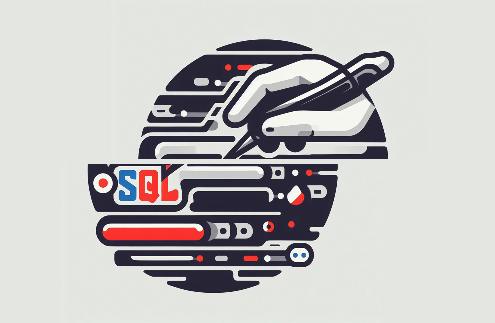

# Che cos'è l'SQL Injection?
L'SQL injection è una vulnerabilità di sicurezza che può verificarsi in un sito web quando gli sviluppatori non gestiscono correttamente i dati inviati dagli utenti. Quando inserisci informazioni in un modulo su un sito web (come un campo di ricerca o un modulo di login), il sito web invia queste informazioni al suo database tramite query SQL (Structured Query Language) per trovare i dati corrispondenti.
<!--truncate-->
Se un sito web non protegge correttamente queste query SQL, un malintenzionato può inserire dati malevoli nel modulo. Se il sito web non filtra o "sanifica" questi dati in modo adeguato, l'attaccante può manipolare la query SQL, facendo sì che il database esegua azioni non autorizzate, come visualizzare, modificare o eliminare dati.

:::info
I **database** in informatica sono come grandi archivi digitali che memorizzano dati. Sono come fogli di calcolo giganti, ma organizzano le informazioni in modo ordinato, consentendo alle applicazioni di memorizzare, recuperare e gestire dati in modo efficiente, come numeri di telefono, immagini o documenti.

Il **Linguaggio di Query Strutturato** (SQL) è un linguaggio informatico utilizzato per comunicare con i database. Permette agli utenti di creare, leggere, aggiornare e cancellare dati nelle basi di dati. Usando comandi come SELECT, INSERT, UPDATE e DELETE, gli utenti possono recuperare informazioni specifiche, aggiungere nuovi dati, modificare record esistenti e eliminare dati indesiderati. 
SQL è ampiamente utilizzato in applicazioni web, software aziendali e in molti altri contesti per gestire grandi quantità di dati in modo efficiente e organizzato.

Ecco un esempio di come potrebbe apparire un'ipotetica tabella "utente" in SQL:

```sql
CREATE TABLE utenti (
    id INT AUTO_INCREMENT PRIMARY KEY,
    username VARCHAR(50) NOT NULL,
    password VARCHAR(255) NOT NULL,
    remember_me BOOLEAN DEFAULT FALSE
);
```

In questo esempio:
- `id` è un campo auto-incrementante che funge da chiave primaria univoca per ogni record nella tabella.
- `username` è un campo di tipo stringa (VARCHAR) con una lunghezza massima di 50 caratteri, che rappresenta il nome utente dell'utente.
- `password` è un campo di tipo stringa (VARCHAR) con una lunghezza massima di 255 caratteri, che rappresenta la password dell'utente. Si consiglia di utilizzare tecniche di hashing sicure per memorizzare le password in modo sicuro.
- `remember_me` è un campo booleano che indica se l'utente ha selezionato l'opzione "Ricordami" durante il login. Di default, è impostato su FALSE.
:::

## Esempio di utilizzo vulnerabilità

:::caution
Le informazioni fornite sono **solo per apprendimento**. L'abuso di tecniche di SQL injection è irresponsabile e illegale. Rusty-Pixel non si assume alcuna responsabilità per l'uso improprio da parte di terzi. La sicurezza è cruciale; utilizza queste conoscenze in modo etico e legale!
:::

Immagina un semplice modulo di login su un sito web. Normalmente, quando inserisci il tuo nome utente e la tua password, il sito verifica se esistono nel database. L'input viene usato in una query SQL come questa:
```sql
SELECT * FROM utenti WHERE username = 'tuo_nome_utente' AND password = 'tua_password';
```

Se il sito non protegge correttamente i dati, un attaccante potrebbe inserire qualcosa di simile a questo nel campo della password:

```sql
' OR '1'='1'; --
```
:::info
In informatica, l'operatore logico **OR** è utilizzato per combinare condizioni. 
Se una qualsiasi delle condizioni collegate dall'operatore **OR** è vera, l'intera espressione è vera. 
Ad esempio, se diciamo "Voglio il gelato **OR** la torta", significa che vuoi **o** il gelato **o** la torta o entrambi. 
L'operatore **OR** è ampiamente usato nei linguaggi di programmazione per creare condizioni flessibili, consentendo a un'azione di verificarsi se almeno una delle condizioni specificate è soddisfatta, semplificando il processo decisionale nei programmi informatici.
:::

La query risultante diventerebbe:

```sql
SELECT * FROM utenti WHERE nome_utente = 'tuo_nome_utente' AND password = '' OR '1'='1'; --';
```

Questa **query SQL** è un esempio di un tentativo di **attacco di SQL injection**. Analizziamo la query passo dopo passo per capire come funziona:

1. `SELECT * FROM utenti`: Questa parte della query seleziona tutte le colonne dalla tabella "utenti" nel database.
2. `WHERE nome_utente = 'tuo_nome_utente'`: Qui viene specificato un filtro, cercando un record in cui il campo "nome_utente" è uguale a un valore specifico (presumibilmente fornito dall'utente, ma in questo caso sostituito con `'tuo_nome_utente'` per illustrare il concetto).
3. `AND password = '' OR '1'='1'`: Questa parte è il cuore dell'attacco di SQL injection. La parte `password = ''` cerca un record in cui il campo "password" è vuoto, ma il problema sta nella seconda parte, `'1'='1'`. Questa condizione è sempre vera (`1` è sempre uguale a `1`), quindi la query restituirà tutti i record in cui il campo "nome_utente" è uguale a `'tuo_nome_utente'` e tutti i record in cui `'1'='1'`.
4. `--'`: Il trattino doppio `--` in SQL è un commento che indica che tutto ciò che segue su quella riga è ignorato dal motore SQL. Questo viene spesso utilizzato dagli attaccanti per ignorare parte della query originale e aggiungere il proprio codice dannoso senza interrompere la query.

Quindi, l'attacco sfrutta il fatto che `'1'='1'` è sempre vero, indipendentemente dai dati nel database. L'intera condizione è quindi sempre vera, e la query restituirà tutti i record della tabella "utenti", permettendo all'attaccante di accedere a dati sensibili o alterare il comportamento dell'applicazione in modo dannoso. Per prevenire attacchi di questo tipo, è fondamentale utilizzare tecniche come le query preparate o gli statementi parametrici, che proteggono automaticamente dai tentativi di SQL injection.

## Come proteggersi dall'SQL Injection?
Per proteggersi dall'SQL injection, gli sviluppatori devono "sanitizzare" i dati dell'utente. Ciò significa assicurarsi che i dati inseriti dagli utenti non possano alterare la struttura delle query SQL.

Ecco un esempio di codice PHP soggetto a SQL injection e una versione sanitizzata per la tabella "utenti" con i campi "username" e "password".

:::info
**PHP** è un linguaggio di scripting largamente utilizzato sul web per creare pagine dinamiche (siti internet, applicazioni, etc...).   
Le istruzioni PHP sono integrate nelle pagine web, eseguite sul server quando un utente fa una richiesta. PHP comunica con i database per salvare o recuperare dati, creando pagine web personalizzate in tempo reale.
:::

**Esempio Soggetto a SQL Injection (NON SICURO):**
```php
// Soggetto a SQL Injection
$username = $_POST['username'];
$password = $_POST['password'];

$query = "SELECT * FROM utenti WHERE username='$username' AND password='$password'";
$result = mysqli_query($conn, $query);
```

In questo esempio, i valori di `$_POST['username']` e `$_POST['password']` sono inseriti direttamente nella query SQL, rendendo l'applicazione vulnerabile all'SQL injection.

**Esempio Sanitizzato (SICURO):**
```php
// Sanitizzato contro SQL Injection
$username = mysqli_real_escape_string($conn, $_POST['username']);
$password = mysqli_real_escape_string($conn, $_POST['password']);

$query = "SELECT * FROM utenti WHERE username='$username' AND password='$password'";
$result = mysqli_query($conn, $query);
```

In questo esempio, `mysqli_real_escape_string()` viene utilizzato per "sanitizzare" i valori di input. Questa funzione protegge dai caratteri speciali che potrebbero essere utilizzati per eseguire un attacco di SQL injection.

Tuttavia, è importante notare che è generalmente preferibile utilizzare le query preparate o gli statementi parametrici, poiché forniscono una protezione più robusta contro l'SQL injection. Ecco un esempio di query preparata:

**Uso di Query Preparata (PREFERIBILE):**
```php
// Query Preparata (Protegge contro SQL Injection)
$stmt = $conn->prepare("SELECT * FROM utenti WHERE username=? AND password=?");
$stmt->bind_param("ss", $username, $password);

$username = $_POST['username'];
$password = $_POST['password'];

$stmt->execute();
$result = $stmt->get_result();
```

In questo esempio, i valori di input vengono passati come parametri e non vengono concatenati nella query, garantendo una maggiore sicurezza contro l'SQL injection.

## Come capire se il proprio sito è soggetto a SQL Injection?
Per capire se il tuo sito è vulnerabile all'SQL injection, verifica se i dati inviati dagli utenti vengono filtrati prima di essere utilizzati nelle query SQL. Controlla i form, le URL e le query del database. Se i dati inseriti dagli utenti non vengono adeguatamente validati o "sanitizzati" prima di essere utilizzati in una query, il tuo sito potrebbe essere vulnerabile. Utilizza tecniche come le query preparate e i framework sicuri per evitare questo rischio.

In alternativa, potresti coinvolgere un esperto di sicurezza informatica per condurre un'analisi dettagliata del tuo sito al fine di identificare potenziali vulnerabilità, tra cui attacchi di tipo SQL injection e altri. Gli esperti utilizzano metodi come l'analisi statica e dinamica del codice, il test di penetrazione, l'ispezione dei log e la valutazione delle configurazioni per valutare la sicurezza del tuo sito.

## Angolo nerd Rust
:::tip
Ciao **ruster**!! Sei ancora qui, ti piace allora eh... ❤️ masochista.  
Ti faccio vedere come potresti sviluppare un punto di partenza per un programma in **Rust** per scansionare il tuo sito internet in cerca di qualche vulnerabilità, oh miraccomando eh, anche se questo codice così con me non farebbe male neanche ad un *commodore 64* rispetta sempre l'etica, io ripeto, me ne lavo le mani.

```rust
extern crate reqwest;
extern crate scraper;

use scraper::{Html, Selector};

fn main() {
    // URL del tuo sito 
    let target_url = "https://example.com";

    // Effettua una richiesta GET alla pagina principale del tuo sito 
    let response = reqwest::blocking::get(target_url);
    
    // Verifica se la richiesta è andata a buon fine
    match response {
        Ok(response) => {
            // Estrai il contenuto HTML dalla risposta
            let body = response.text().unwrap();
            let document = Html::parse_document(&body);

            // Usa il selettore per trovare elementi specifici nella pagina
            let selector = Selector::parse("selector").unwrap();
            let elements = document.select(&selector);

            // Analizza gli elementi trovati e verifica la presenza di vulnerabilità
            for element in elements {
                // Fai qualcosa con gli elementi trovati
                println!("{:?}", element.text());
            }
        }
        Err(err) => {
            // Gestisci gli errori di richiesta
            eprintln!("Errore nella richiesta: {}", err);
        }
    }
}
```
:::